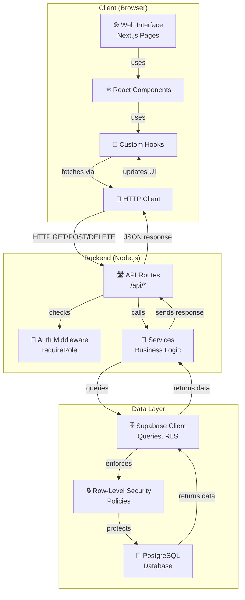
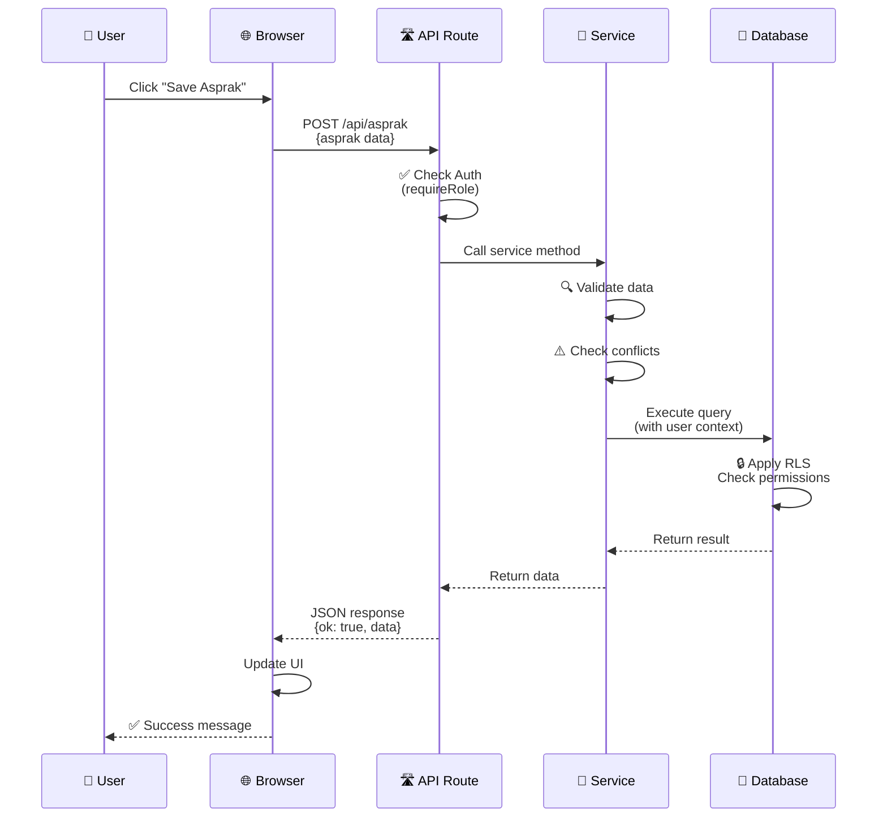
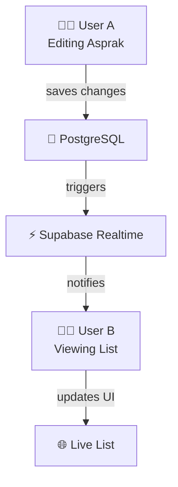
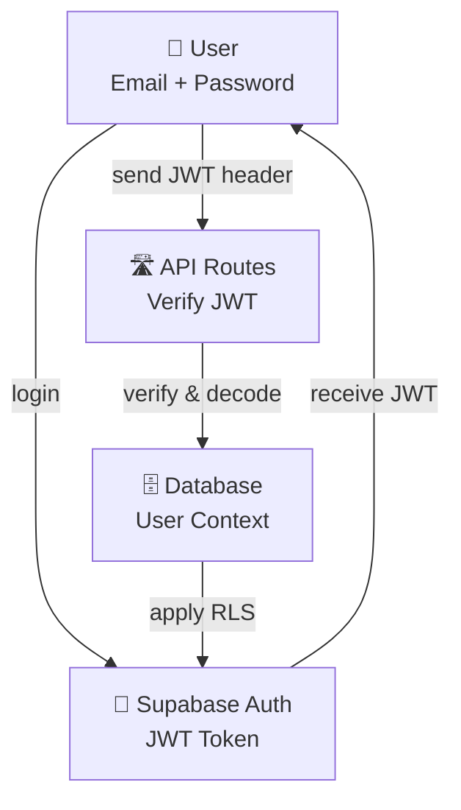

# System Architecture - Sistem Manajemen Asprak

**Document Type**: Architecture Design Document  
**Last Updated**: March 16, 2026  
**Author**: Development Team  
**Status**: Approved

---

## 📑 Table of Contents

1. [Overview](#overview)
2. [Architecture Layers](#architecture-layers)
3. [Component Diagram](#component-diagram)
4. [Data Flow](#data-flow)
5. [Technology Stack](#technology-stack)
6. [Key Design Decisions](#key-design-decisions)
7. [Scalability](#scalability)
8. [Security Architecture](#security-architecture)

---

## 🎯 Overview

Sistem Manajemen Asprak menggunakan **modern web application architecture** dengan pemisahan yang jelas antara frontend, backend, dan database layers. Arsitektur ini dirancang untuk:

- **Scalability**: Mudah untuk scale horizontal
- **Maintainability**: Clear separation of concerns
- **Type Safety**: End-to-end TypeScript
- **Security**: Multi-layer security controls
- **Performance**: Optimized data fetching dan caching

---

## 🏗️ Architecture Layers

### Layer 1: Frontend Layer (Client-Side)

**Framework**: Next.js 16.1 (App Router with React Server Components)

```
┌─────────────────────────────────────────────────────────┐
│                     FRONTEND LAYER                      │
├─────────────────────────────────────────────────────────┤
│                                                         │
│  Pages (/app/(dashboard)/*)                            │
│  ├─ Page Components (RSC/Client)                       │
│  ├─ Data Fetching (useAsprak, useJadwal, etc)         │
│  └─ Client-side State Management                       │
│                                                         │
│  Components (/components/*)                            │
│  ├─ UI Components (Shadcn UI)                         │
│  ├─ Feature Components                                 │
│  └─ Layout Components                                  │
│                                                         │
│  Hooks (/hooks/*)                                      │
│  ├─ Custom Data Hooks (SWR pattern)                   │
│  ├─ Authentication Hooks                               │
│  └─ UI State Hooks                                     │
│                                                         │
│  Lib (/lib/fetchers/*)                                │
│  └─ HTTP Client Functions                              │
│                                                         │
└─────────────────────────────────────────────────────────┘
```

**Responsibilities**:

- Render user interface
- Handle user interactions
- Fetch data from API routes
- Display real-time updates
- Client-side validation & error handling

**Technology**: React 19, TypeScript, Tailwind CSS, Shadcn UI

### Layer 2: API Layer (Next.js Route Handlers)

**Location**: `/src/app/api/`

```
┌─────────────────────────────────────────────────────────┐
│                      API LAYER                          │
├─────────────────────────────────────────────────────────┤
│                                                         │
│  API Routes (HTTP Adapters)                            │
│  ├─ /api/asprak        (GET, POST, DELETE)            │
│  ├─ /api/jadwal        (GET, POST, PUT, DELETE)       │
│  ├─ /api/pelanggaran   (GET, POST, DELETE)            │
│  ├─ /api/plotting      (POST)                          │
│  ├─ /api/import        (POST)                          │
│  ├─ /api/export        (GET)                           │
│  ├─ /api/admin/*       (Admin operations)              │
│  └─ /api/system/*      (System operations)             │
│                                                         │
│  HTTP Request → Route Handler                          │
│  ├─ Authentication Check (requireRole)                 │
│  ├─ Request Validation                                 │
│  ├─ Service Layer Call                                 │
│  └─ Response Formatting                                │
│                                                         │
└─────────────────────────────────────────────────────────┘
```

**Responsibilities**:

- HTTP request/response handling
- Authentication & authorization checks
- Input validation
- Route service layer
- Error handling & formatting
- Response caching headers

**Pattern**: HTTP adapter pattern - thin layer that routes to services

### Layer 3: Business Logic Layer (Services)

**Location**: `/src/services/`

```
┌─────────────────────────────────────────────────────────┐
│              BUSINESS LOGIC LAYER                       │
├─────────────────────────────────────────────────────────┤
│                                                         │
│  Core Services:                                         │
│  ├─ asprakService          - Asprak CRUD & operations  │
│  ├─ jadwalService          - Schedule management       │
│  ├─ pelanggaranService     - Violation tracking        │
│  ├─ plottingService        - Plotting & validation     │
│  ├─ praktikumService       - Course management         │
│  ├─ mataKuliahService      - Subject management        │
│  ├─ modulScheduleService   - Module scheduling         │
│  ├─ termService            - Academic term management  │
│  ├─ auditLogService        - Audit trail logging       │
│  └─ systemService          - System operations         │
│                                                         │
│  Responsibilities:                                      │
│  ├─ Business rule enforcement                          │
│  ├─ Data validation & conflict detection               │
│  ├─ Complex queries & aggregations                     │
│  ├─ Transaction management                             │
│  └─ Error handling                                      │
│                                                         │
└─────────────────────────────────────────────────────────┘
```

**Responsibilities**:

- Core business logic implementation
- Data validation & conflict detection
- Complex queries & data transformations
- Transaction management
- Service-level error handling

**Pattern**: Service pattern - encapsulated business logic

### Layer 4: Data Access Layer (Supabase Client)

**Location**: `/src/lib/supabase/` and service functions

```
┌─────────────────────────────────────────────────────────┐
│              DATA ACCESS LAYER                          │
├─────────────────────────────────────────────────────────┤
│                                                         │
│  Supabase Clients:                                      │
│  ├─ Server Client (Middleware & API Routes)           │
│  └─ Admin Client (Privileged Operations)              │
│                                                         │
│  Query Methods:                                         │
│  ├─ Select, Insert, Update, Delete                     │
│  ├─ Joins & Complex Queries                            │
│  └─ Bulk Operations                                    │
│                                                         │
│  Security:                                              │
│  ├─ Row-Level Security (RLS) Policies                 │
│  ├─ Automatic User Context Injection                   │
│  └─ Permission Validation                              │
│                                                         │
└─────────────────────────────────────────────────────────┘
```

**Responsibilities**:

- Database query execution
- Row-level security enforcement
- Connection pooling & management
- Transaction handling
- Real-time subscription support

### Layer 5: Database Layer (PostgreSQL)

**Location**: Supabase PostgreSQL database

```
┌─────────────────────────────────────────────────────────┐
│              DATABASE LAYER                             │
├─────────────────────────────────────────────────────────┤
│                                                         │
│  Tables:                                                │
│  ├─ Auth Tables (managed by Supabase)                  │
│  ├─ pengguna (users/roles)                             │
│  ├─ asprak                                              │
│  ├─ jadwal                                              │
│  ├─ pelanggaran                                         │
│  ├─ praktikum                                           │
│  ├─ mata_kuliah                                         │
│  ├─ asprak_koordinator                                 │
│  ├─ asprak_praktikum                                   │
│  ├─ modul_schedule                                     │
│  ├─ audit_logs                                         │
│  └─ system_settings                                    │
│                                                         │
│  RLS Policies:                                          │
│  ├─ Admin can access everything                        │
│  ├─ Role-based access control                          │
│  └─ User-specific data isolation                       │
│                                                         │
│  Indexes & Constraints:                                │
│  ├─ Primary keys                                       │
│  ├─ Foreign keys                                       │
│  └─ Performance indexes                                │
│                                                         │
└─────────────────────────────────────────────────────────┘
```

**Responsibilities**:

- Data persistence
- Data integrity via constraints
- Performance optimization via indexes
- Row-level security enforcement
- Backup & recovery

---

## 🔄 Component Diagram



---

## 📊 Data Flow

### Typical Request/Response Flow



### Real-time Data Updates



---

## 🛠️ Technology Stack Breakdown

### Frontend Technologies

| Technology     | Purpose                         | Version      |
| -------------- | ------------------------------- | ------------ |
| Next.js        | React framework with App Router | 16.1         |
| React          | UI library                      | 19           |
| TypeScript     | Type safety                     | Latest       |
| Tailwind CSS   | Utility-first CSS               | 4.x          |
| Shadcn UI      | Component library               | Latest       |
| TanStack Table | Data table logic                | Latest       |
| Recharts       | Charts & graphs                 | Latest       |
| SWR Pattern    | Data fetching                   | Custom hooks |

### Backend Technologies

| Technology         | Purpose            | Version |
| ------------------ | ------------------ | ------- |
| Node.js            | JavaScript runtime | 18+     |
| Next.js API Routes | HTTP endpoints     | 16.1    |
| TypeScript         | Type safety        | Latest  |
| Supabase Client    | Database & auth    | Latest  |

### Infrastructure

| Service        | Purpose             | Provider          |
| -------------- | ------------------- | ----------------- |
| PostgreSQL     | Relational database | Supabase          |
| Authentication | User management     | Supabase Auth     |
| Realtime       | Live updates        | Supabase Realtime |
| Storage        | File storage        | Supabase Storage  |

---

## 🎯 Key Design Decisions

### 1. Next.js App Router with Server Components

**Decision**: Use Next.js 16.1 App Router with React Server Components

**Rationale**:

- Built-in API routes - no separate backend needed
- Server Components reduce client-side JavaScript
- Type-safe data fetching
- Better performance & SEO
- Integrated authentication middleware support

**Trade-offs**:

- Learning curve for RSC patterns
- Smaller ecosystem compared to separate backend

---

### 2. Supabase as Backend-as-a-Service

**Decision**: Use Supabase for database, auth, and realtime

**Rationale**:

- PostgreSQL with real-time capabilities
- Built-in authentication & authorization
- Row-Level Security for fine-grained access control
- Serverless - no infrastructure management
- Easy to scale

**Trade-offs**:

- Vendor lock-in (but open-source compatible)
- Limited to Supabase features
- Potential cost at scale

---

### 3. Service Layer Pattern

**Decision**: Encapsulate business logic in service functions

**Rationale**:

- Reusable business logic
- Easy to test
- Separation of concerns
- Testable in isolation

**Implementation**:

```typescript
// Service layer - business logic
async function upsertAsprak(data, supabase) {
  // Validation
  // Conflict detection
  // Database operation
}

// API route - HTTP adapter
export async function POST(req) {
  const body = await req.json();
  const result = await upsertAsprak(body.data, supabase);
  return NextResponse.json({ ok: true, data: result });
}
```

---

### 4. Role-Based Access Control (RBAC)

**Decision**: Implement multi-level RBAC

**Levels**:

1. **Database Level (RLS)**: Row-level security policies
2. **API Level**: `requireRole()` middleware
3. **UI Level**: Conditional rendering based on roles

**Roles**:

- `ADMIN`: Full system access
- `ASLAB`: Operational access (asprak, jadwal, pelanggaran)
- `ASPRAK_KOOR`: Limited coordinator access

---

### 5. Immutable Violation Records

**Decision**: Once pelanggaran (violation) is finalized, it cannot be modified

**Rationale**:

- Data integrity & compliance
- Prevents tampering
- Audit trail purposes
- Fair & transparent discipline system

**Implementation**: Flag-based finalization with separate reset permission

---

### 6. Audit Logging

**Decision**: Log all significant data changes

**What's Logged**:

- CREATE operations
- UPDATE operations
- DELETE operations
- User ID & timestamp
- Old and new values (for important fields)

**Purpose**: Compliance, debugging, dispute resolution

---

## 📈 Scalability

### Horizontal Scalability

**Frontend**:

- Stateless Next.js server - can run multiple instances
- Static assets cached on CDN
- Client-side caching reduces server load

**Backend**:

- Stateless API routes - seamless scaling
- Load balancer distributes traffic
- Session data stored in database (not in-memory)

**Database**:

- PostgreSQL connection pooling (via Supabase)
- Indexes on frequently queried columns
- Archive old audit logs to separate storage

### Performance Optimizations

**Frontend**:

- Server Components reduce JS bundle size
- Image optimization with Next.js Image component
- Static generation where possible
- Incremental Static Regeneration (ISR)

**Backend**:

- Query optimization & indexing
- Caching with appropriate headers
- Batch operations for bulk imports

**Database**:

- Indexes on foreign keys
- Indexes on frequently filtered columns
- Connection pooling
- Query optimization

---

## 🔒 Security Architecture

### Authentication Flow



### Authorization Layers

1. **JWT Verification**: Supabase validates JWT token
2. **API Middleware**: `requireRole()` checks authorization
3. **RLS Policies**: Database enforces row-level permissions
4. **UI Checks**: Conditional rendering based on role

### Data Protection

- **HTTPS**: All traffic encrypted in transit
- **RLS**: Row-level security at database level
- **Input Validation**: Sanitization at API layer
- **SQL Injection Prevention**: Parameterized queries via Supabase client
- **CSRF Protection**: Built-in with Next.js

---

## 🔌 Integrations

### External Services

| Service  | Purpose                  | Integration Point    |
| -------- | ------------------------ | -------------------- |
| Supabase | Database & Auth          | `/src/lib/supabase/` |
| Email    | Notifications (if added) | Future integration   |

### Data Import/Export

- **Import**: CSV → Validation → Bulk insert
- **Export**: Database query → Format → Download

---

## 📝 Related Documents

- [API Reference](./API_REFERENCE.md) - API endpoints
- [Database Schema](./DATABASE.md) - Database design
- [Services Documentation](./SERVICES.md) - Service layer details
- [Development Guide](./DEVELOPMENT.md) - Setup & development
- [Deployment Guide](./DEPLOYMENT.md) - Production deployment
- [Security Guide](./SECURITY.md) - Security details

---

**Last Updated**: March 16, 2026  
**Reviewed By**: Architecture Team  
**Next Review**: June 16, 2026
