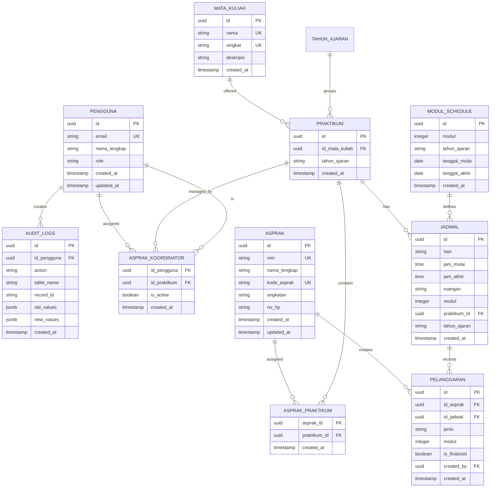

# Database Schema - Sistem Manajemen Asprak

**Document Type**: Database Design Document  
**Last Updated**: March 16, 2026  
**Database**: PostgreSQL (via Supabase)  
**Status**: Active

---

## 📑 Table of Contents

1. [Overview](#overview)
2. [Entity Relationship Diagram](#entity-relationship-diagram)
3. [Core Tables](#core-tables)
4. [Query Patterns](#query-patterns)
5. [Indexes & Performance](#indexes--performance)
6. [Constraints & Validations](#constraints--validations)

---

## 🎯 Overview

The database uses a **relational model** optimized for:

- Role-based access control (RLS policies)
- Complex queries for reporting
- Data integrity with constraints
- Performance with strategic indexes

**Key Principles**:

- Normalized schema to prevent data duplication
- Foreign key constraints for referential integrity
- RLS policies for row-level security
- Audit trail for compliance

---

## 🔗 Entity Relationship Diagram



---

## 📋 Core Tables

### 1. `pengguna` - User Accounts

Stores user authentication and profile information.

#### Schema

| Column         | Type      | Constraints      | Description                           |
| -------------- | --------- | ---------------- | ------------------------------------- |
| `id`           | UUID      | PK               | Auto-generated unique identifier      |
| `email`        | VARCHAR   | UNIQUE, NOT NULL | User email for login                  |
| `nama_lengkap` | VARCHAR   | NOT NULL         | Full name                             |
| `role`         | VARCHAR   | NOT NULL         | User role (ADMIN, ASLAB, ASPRAK_KOOR) |
| `created_at`   | TIMESTAMP | DEFAULT NOW()    | Creation timestamp                    |
| `updated_at`   | TIMESTAMP | DEFAULT NOW()    | Last update timestamp                 |

#### SQL

```sql
CREATE TABLE pengguna (
  id uuid PRIMARY KEY DEFAULT gen_random_uuid(),
  email varchar UNIQUE NOT NULL,
  nama_lengkap varchar NOT NULL,
  role varchar NOT NULL CHECK (role IN ('ADMIN', 'ASLAB', 'ASPRAK_KOOR')),
  created_at timestamp DEFAULT now(),
  updated_at timestamp DEFAULT now()
);
```

#### Sample Data

```sql
INSERT INTO pengguna (email, nama_lengkap, role) VALUES
('admin@lab.id', 'Admin Lab', 'ADMIN'),
('aslab@lab.id', 'Aslab Staff', 'ASLAB'),
('koor@lab.id', 'Koordinator Asprak', 'ASPRAK_KOOR');
```

---

### 2. `asprak` - Teaching Assistants

Stores teaching assistant information.

#### Schema

| Column         | Type      | Constraints      | Description                   |
| -------------- | --------- | ---------------- | ----------------------------- |
| `id`           | UUID      | PK               | Unique identifier             |
| `nim`          | VARCHAR   | UNIQUE, NOT NULL | Student ID number (unique)    |
| `nama_lengkap` | VARCHAR   | NOT NULL         | Full name                     |
| `kode_asprak`  | VARCHAR   | UNIQUE, NOT NULL | Asprak code (e.g., JD2024001) |
| `angkatan`     | VARCHAR   | NOT NULL         | Year/cohort (e.g., "2024")    |
| `no_hp`        | VARCHAR   | -                | Phone number                  |
| `created_at`   | TIMESTAMP | DEFAULT NOW()    | Creation timestamp            |
| `updated_at`   | TIMESTAMP | DEFAULT NOW()    | Last update timestamp         |

#### SQL

```sql
CREATE TABLE asprak (
  id uuid PRIMARY KEY DEFAULT gen_random_uuid(),
  nim varchar UNIQUE NOT NULL,
  nama_lengkap varchar NOT NULL,
  kode_asprak varchar UNIQUE NOT NULL,
  angkatan varchar NOT NULL,
  no_hp varchar,
  created_at timestamp DEFAULT now(),
  updated_at timestamp DEFAULT now()
);

-- Indexes
CREATE INDEX idx_asprak_nim ON asprak(nim);
CREATE INDEX idx_asprak_kode ON asprak(kode_asprak);
CREATE INDEX idx_asprak_angkatan ON asprak(angkatan);
```

#### Validation Rules

- **NIM**: Must be unique, numeric
- **kode_asprak**: Format = First 2 letters of name + Year + Increment (e.g., JD2024001)
- **angkatan**: Year in format YYYY

---

### 3. `mata_kuliah` - Subjects

Stores course/subject information.

#### Schema

| Column       | Type      | Constraints      | Description           |
| ------------ | --------- | ---------------- | --------------------- |
| `id`         | UUID      | PK               | Unique identifier     |
| `nama`       | VARCHAR   | UNIQUE, NOT NULL | Full course name      |
| `singkat`    | VARCHAR   | UNIQUE, NOT NULL | Short code (e.g., DB) |
| `deskripsi`  | TEXT      | -                | Course description    |
| `created_at` | TIMESTAMP | DEFAULT NOW()    | Creation timestamp    |

#### SQL

```sql
CREATE TABLE mata_kuliah (
  id uuid PRIMARY KEY DEFAULT gen_random_uuid(),
  nama varchar UNIQUE NOT NULL,
  singkat varchar UNIQUE NOT NULL,
  deskripsi text,
  created_at timestamp DEFAULT now()
);

-- Indexes
CREATE INDEX idx_mata_kuliah_singkat ON mata_kuliah(singkat);
CREATE INDEX idx_mata_kuliah_nama ON mata_kuliah(nama);
```

#### Sample Data

```sql
INSERT INTO mata_kuliah (nama, singkat, deskripsi) VALUES
('Database Systems', 'DB', 'Fundamentals of database design'),
('Web Programming', 'WEB', 'Modern web development frameworks'),
('Algorithms', 'ALG', 'Algorithm analysis and design');
```

---

### 4. `praktikum` - Practicum Sessions

Groups courses by academic term.

#### Schema

| Column           | Type      | Constraints      | Description                |
| ---------------- | --------- | ---------------- | -------------------------- |
| `id`             | UUID      | PK               | Unique identifier          |
| `id_mata_kuliah` | UUID      | FK → mata_kuliah | Course being offered       |
| `tahun_ajaran`   | VARCHAR   | NOT NULL         | Academic term (YYYY/[1,2]) |
| `created_at`     | TIMESTAMP | DEFAULT NOW()    | Creation timestamp         |

#### SQL

```sql
CREATE TABLE praktikum (
  id uuid PRIMARY KEY DEFAULT gen_random_uuid(),
  id_mata_kuliah uuid NOT NULL REFERENCES mata_kuliah(id) ON DELETE RESTRICT,
  tahun_ajaran varchar NOT NULL,
  created_at timestamp DEFAULT now(),
  UNIQUE(id_mata_kuliah, tahun_ajaran)
);

-- Indexes
CREATE INDEX idx_praktikum_tahun ON praktikum(tahun_ajaran);
CREATE INDEX idx_praktikum_mk ON praktikum(id_mata_kuliah);
```

#### Notes

- One course can have multiple practicum sessions across different terms
- Unique constraint ensures only one practicum per course per term

---

### 5. `jadwal` - Weekly Schedules

Stores weekly practicum schedules.

#### Schema

| Column         | Type      | Constraints    | Description                 |
| -------------- | --------- | -------------- | --------------------------- |
| `id`           | UUID      | PK             | Unique identifier           |
| `praktikum_id` | UUID      | FK → praktikum | Associated practicum        |
| `hari`         | VARCHAR   | NOT NULL       | Day of week (Monday-Friday) |
| `jam_mulai`    | TIME      | NOT NULL       | Start time (HH:MM)          |
| `jam_akhir`    | TIME      | NOT NULL       | End time (HH:MM)            |
| `ruangan`      | VARCHAR   | NOT NULL       | Room/lab name               |
| `modul`        | INTEGER   | NOT NULL       | Module number (1-n)         |
| `tahun_ajaran` | VARCHAR   | NOT NULL       | Academic term               |
| `created_at`   | TIMESTAMP | DEFAULT NOW()  | Creation timestamp          |

#### SQL

```sql
CREATE TABLE jadwal (
  id uuid PRIMARY KEY DEFAULT gen_random_uuid(),
  praktikum_id uuid NOT NULL REFERENCES praktikum(id) ON DELETE CASCADE,
  hari varchar NOT NULL CHECK (hari IN ('Monday', 'Tuesday', 'Wednesday', 'Thursday', 'Friday')),
  jam_mulai time NOT NULL,
  jam_akhir time NOT NULL,
  ruangan varchar NOT NULL,
  modul integer NOT NULL,
  tahun_ajaran varchar NOT NULL,
  created_at timestamp DEFAULT now()
);

-- Indexes for performance
CREATE INDEX idx_jadwal_praktikum ON jadwal(praktikum_id);
CREATE INDEX idx_jadwal_tahun ON jadwal(tahun_ajaran);
CREATE INDEX idx_jadwal_modul ON jadwal(modul);
```

#### Constraints

- Start time must be before end time (checked in application)
- Valid hari values: Monday, Tuesday, Wednesday, Thursday, Friday

---

### 6. `asprak_praktikum` - Asprak-Course Assignments

Junction table linking asprak to courses they manage.

#### Schema

| Column         | Type      | Constraints   | Description        |
| -------------- | --------- | ------------- | ------------------ |
| `asprak_id`    | UUID      | FK, PK        | Asprak ID          |
| `praktikum_id` | UUID      | FK, PK        | Practicum ID       |
| `created_at`   | TIMESTAMP | DEFAULT NOW() | Creation timestamp |

#### SQL

```sql
CREATE TABLE asprak_praktikum (
  asprak_id uuid NOT NULL REFERENCES asprak(id) ON DELETE CASCADE,
  praktikum_id uuid NOT NULL REFERENCES praktikum(id) ON DELETE CASCADE,
  PRIMARY KEY (asprak_id, praktikum_id),
  created_at timestamp DEFAULT now()
);

-- Indexes
CREATE INDEX idx_asprak_praktikum_asprak ON asprak_praktikum(asprak_id);
CREATE INDEX idx_asprak_praktikum_praktikum ON asprak_praktikum(praktikum_id);
```

#### Notes

- One asprak can be assigned to multiple courses
- One course can have multiple assigned asprak
- Cascade delete ensures cleanup when asprak or praktikum is deleted

---

### 7. `pelanggaran` - Violations

Records disciplinary violations for asprak.

#### Schema

| Column         | Type      | Constraints   | Description                      |
| -------------- | --------- | ------------- | -------------------------------- |
| `id`           | UUID      | PK            | Unique identifier                |
| `id_asprak`    | UUID      | FK → asprak   | Asprak who violated              |
| `id_jadwal`    | UUID      | FK → jadwal   | Session where violation occurred |
| `jenis`        | VARCHAR   | NOT NULL      | Violation type                   |
| `modul`        | INTEGER   | NOT NULL      | Module number                    |
| `is_finalized` | BOOLEAN   | DEFAULT FALSE | Immutable if finalized           |
| `created_by`   | UUID      | FK → pengguna | User who recorded                |
| `created_at`   | TIMESTAMP | DEFAULT NOW() | Creation timestamp               |

#### SQL

```sql
CREATE TABLE pelanggaran (
  id uuid PRIMARY KEY DEFAULT gen_random_uuid(),
  id_asprak uuid NOT NULL REFERENCES asprak(id) ON DELETE CASCADE,
  id_jadwal uuid NOT NULL REFERENCES jadwal(id) ON DELETE CASCADE,
  jenis varchar NOT NULL CHECK (jenis IN ('Tidak Hadir', 'Terlambat', 'Tidak Lengkap', 'Lainnya')),
  modul integer NOT NULL,
  is_finalized boolean DEFAULT false,
  created_by uuid NOT NULL REFERENCES pengguna(id),
  created_at timestamp DEFAULT now()
);

-- Indexes
CREATE INDEX idx_pelanggaran_asprak ON pelanggaran(id_asprak);
CREATE INDEX idx_pelanggaran_jadwal ON pelanggaran(id_jadwal);
CREATE INDEX idx_pelanggaran_finalized ON pelanggaran(is_finalized);
```

#### Violation Types

- `Tidak Hadir` - Absent (no show)
- `Terlambat` - Late
- `Tidak Lengkap` - Incomplete work
- `Lainnya` - Other

#### Immutability Logic

```sql
-- Update trigger (enforces immutability if finalized)
CREATE OR REPLACE FUNCTION check_pelanggaran_finalized()
RETURNS TRIGGER AS $$
BEGIN
  IF OLD.is_finalized = true AND NEW.is_finalized = true THEN
    RAISE EXCEPTION 'Cannot update finalized violation record';
  END IF;
  RETURN NEW;
END;
$$ LANGUAGE plpgsql;

CREATE TRIGGER trigger_pelanggaran_finalized
  BEFORE UPDATE ON pelanggaran
  FOR EACH ROW
  EXECUTE FUNCTION check_pelanggaran_finalized();
```

---

### 8. `asprak_koordinator` - Coordinator Assignments

Links coordinators to practicum sessions they manage.

#### Schema

| Column         | Type      | Constraints   | Description        |
| -------------- | --------- | ------------- | ------------------ |
| `id_pengguna`  | UUID      | FK, PK        | User ID            |
| `id_praktikum` | UUID      | FK, PK        | Practicum ID       |
| `is_active`    | BOOLEAN   | DEFAULT TRUE  | Active status      |
| `created_at`   | TIMESTAMP | DEFAULT NOW() | Creation timestamp |

#### SQL

```sql
CREATE TABLE asprak_koordinator (
  id_pengguna uuid NOT NULL REFERENCES pengguna(id) ON DELETE CASCADE,
  id_praktikum uuid NOT NULL REFERENCES praktikum(id) ON DELETE CASCADE,
  PRIMARY KEY (id_pengguna, id_praktikum),
  is_active boolean DEFAULT true,
  created_at timestamp DEFAULT now()
);

-- Indexes
CREATE INDEX idx_asprak_koor_pengguna ON asprak_koordinator(id_pengguna);
CREATE INDEX idx_asprak_koor_praktikum ON asprak_koordinator(id_praktikum);
CREATE INDEX idx_asprak_koor_active ON asprak_koordinator(is_active);
```

#### Notes

- Coordinators can only see/manage violations for their assigned practicum
- `is_active` flag allows soft-deactivation without deleting records

---

### 9. `modul_schedule` - Module Scheduling

Defines which modules are active during specific date ranges.

#### Schema

| Column          | Type      | Constraints   | Description        |
| --------------- | --------- | ------------- | ------------------ |
| `id`            | UUID      | PK            | Unique identifier  |
| `modul`         | INTEGER   | NOT NULL      | Module number      |
| `tahun_ajaran`  | VARCHAR   | NOT NULL      | Academic term      |
| `tanggal_mulai` | DATE      | NOT NULL      | Start date         |
| `tanggal_akhir` | DATE      | NOT NULL      | End date           |
| `created_at`    | TIMESTAMP | DEFAULT NOW() | Creation timestamp |

#### SQL

```sql
CREATE TABLE modul_schedule (
  id uuid PRIMARY KEY DEFAULT gen_random_uuid(),
  modul integer NOT NULL,
  tahun_ajaran varchar NOT NULL,
  tanggal_mulai date NOT NULL,
  tanggal_akhir date NOT NULL,
  created_at timestamp DEFAULT now(),
  CHECK (tanggal_mulai <= tanggal_akhir),
  UNIQUE(modul, tahun_ajaran)
);

-- Indexes
CREATE INDEX idx_modul_schedule_tahun ON modul_schedule(tahun_ajaran);
CREATE INDEX idx_modul_schedule_tanggal ON modul_schedule(tanggal_mulai, tanggal_akhir);
```

---

### 10. `audit_logs` - Audit Trail

Records all significant data changes for compliance and debugging.

#### Schema

| Column        | Type      | Constraints   | Description                          |
| ------------- | --------- | ------------- | ------------------------------------ |
| `id`          | UUID      | PK            | Unique identifier                    |
| `id_pengguna` | UUID      | FK → pengguna | User who made change                 |
| `action`      | VARCHAR   | NOT NULL      | Action type (INSERT, UPDATE, DELETE) |
| `table_name`  | VARCHAR   | NOT NULL      | Table affected                       |
| `record_id`   | VARCHAR   | NOT NULL      | Record ID that was affected          |
| `old_values`  | JSONB     | -             | Old field values (for UPDATE)        |
| `new_values`  | JSONB     | -             | New field values                     |
| `created_at`  | TIMESTAMP | DEFAULT NOW() | Timestamp of change                  |

#### SQL

```sql
CREATE TABLE audit_logs (
  id uuid PRIMARY KEY DEFAULT gen_random_uuid(),
  id_pengguna uuid NOT NULL REFERENCES pengguna(id),
  action varchar NOT NULL CHECK (action IN ('INSERT', 'UPDATE', 'DELETE')),
  table_name varchar NOT NULL,
  record_id varchar NOT NULL,
  old_values jsonb,
  new_values jsonb,
  created_at timestamp DEFAULT now()
);

-- Indexes for queries
CREATE INDEX idx_audit_logs_user ON audit_logs(id_pengguna);
CREATE INDEX idx_audit_logs_table ON audit_logs(table_name);
CREATE INDEX idx_audit_logs_record ON audit_logs(record_id);
CREATE INDEX idx_audit_logs_created ON audit_logs(created_at);
```

#### Sample Query

```sql
-- Get all changes to an asprak record
SELECT * FROM audit_logs
WHERE table_name = 'asprak'
  AND record_id = '...'
ORDER BY created_at DESC;
```

---

## 🔍 Query Patterns

### Get All Asprak with Their Assignments

```sql
SELECT
  a.id,
  a.nim,
  a.nama_lengkap,
  a.kode_asprak,
  json_agg(json_build_object(
    'praktikum_id', ap.praktikum_id,
    'mk_nama', mk.nama,
    'mk_singkat', mk.singkat
  )) as assignments
FROM asprak a
LEFT JOIN asprak_praktikum ap ON a.id = ap.asprak_id
LEFT JOIN praktikum p ON ap.praktikum_id = p.id
LEFT JOIN mata_kuliah mk ON p.id_mata_kuliah = mk.id
WHERE p.tahun_ajaran = '2024/1'
GROUP BY a.id, a.nim, a.nama_lengkap, a.kode_asprak;
```

### Get Violations Summary for a Term

```sql
SELECT
  a.nama_lengkap,
  COUNT(p.id) as total_violations,
  json_agg(json_build_object(
    'jenis', p.jenis,
    'modul', p.modul,
    'tanggal', p.created_at
  )) as details
FROM asprak a
LEFT JOIN pelanggaran p ON a.id = p.id_asprak
LEFT JOIN jadwal j ON p.id_jadwal = j.id
WHERE j.tahun_ajaran = '2024/1'
GROUP BY a.id, a.nama_lengkap
HAVING COUNT(p.id) > 0
ORDER BY total_violations DESC;
```

### Get Weekly Schedule with Assignments

```sql
SELECT
  j.id,
  j.hari,
  j.jam_mulai,
  j.jam_akhir,
  j.ruangan,
  mk.singkat,
  COUNT(ap.asprak_id) as num_asprak,
  json_agg(a.nama_lengkap) as asprak_list
FROM jadwal j
JOIN praktikum pr ON j.praktikum_id = pr.id
JOIN mata_kuliah mk ON pr.id_mata_kuliah = mk.id
LEFT JOIN asprak_praktikum ap ON pr.id = ap.praktikum_id
LEFT JOIN asprak a ON ap.asprak_id = a.id
WHERE j.tahun_ajaran = '2024/1'
  AND j.modul = 1
GROUP BY j.id, j.hari, j.jam_mulai, j.jam_akhir, j.ruangan, mk.singkat
ORDER BY j.hari, j.jam_mulai;
```

---

## 📊 Indexes & Performance

### Key Indexes Created

| Table       | Column       | Type   | Purpose                         |
| ----------- | ------------ | ------ | ------------------------------- |
| asprak      | nim          | UNIQUE | Prevent duplicates, fast lookup |
| asprak      | kode_asprak  | UNIQUE | Prevent duplicates, code lookup |
| asprak      | angkatan     | INDEX  | Filter by year                  |
| jadwal      | praktikum_id | INDEX  | Fast joins                      |
| jadwal      | tahun_ajaran | INDEX  | Filter by term                  |
| pelanggaran | id_asprak    | INDEX  | Fast lookups                    |
| pelanggaran | is_finalized | INDEX  | Filter finalized records        |
| audit_logs  | created_at   | INDEX  | Timeline queries                |

### Query Performance Tips

1. **Use Pagination**: For large result sets, always paginate

   ```sql
   SELECT * FROM asprak LIMIT 20 OFFSET 0;
   ```

2. **Leverage Indexes**: Filter on indexed columns first

   ```sql
   -- Good: Uses index on tahun_ajaran
   SELECT * FROM jadwal WHERE tahun_ajaran = '2024/1';
   ```

3. **Avoid SELECT \***: Only retrieve needed columns
   ```sql
   -- Better than SELECT *
   SELECT id, nim, nama_lengkap FROM asprak;
   ```

---

## ☑️ Constraints & Validations

### Referential Integrity

- Foreign key constraints ensure data consistency
- ON DELETE CASCADE for non-critical deletions
- ON DELETE RESTRICT for critical relationships

### Data Validations

| Table       | Field                | Rule                                 |
| ----------- | -------------------- | ------------------------------------ |
| asprak      | nim                  | Numeric, unique, not null            |
| asprak      | kode_asprak          | Alphanumeric, unique, not null       |
| praktikum   | tahun_ajaran         | Format YYYY/[1,2], not null          |
| jadwal      | hari                 | Must be weekday (Monday-Friday)      |
| jadwal      | jam_mulai, jam_akhir | Valid time format                    |
| pelanggaran | jenis                | Must be one of 4 types               |
| pelanggaran | is_finalized         | Cannot be unfinalizedafter finalized |

### Application-Level Validations

See [Services Documentation](./SERVICES.md) for business logic validations:

- Conflict detection (schedule overlaps)
- Duplicate prevention
- State machine enforcement

---

## 🔐 Row-Level Security (RLS)

RLS policies enforce access control at the database level:

### Policy Examples

```sql
-- ADMIN can see everything
CREATE POLICY admin_all ON asprak
  AS SELECT TO authenticated
  USING ((SELECT role FROM pengguna WHERE id = auth.uid()) = 'ADMIN');

-- ASPRAK_KOOR can only see violations for their courses
CREATE POLICY koor_violations ON pelanggaran
  AS SELECT TO authenticated
  USING (EXISTS (
    SELECT 1 FROM asprak_koordinator
    WHERE id_pengguna = auth.uid()
      AND is_active = true
  ));
```

---

## 📔 Related Documents

- [Architecture Document](./ARCHITECTURE.md)
- [API Reference](./API_REFERENCE.md)
- [Services Documentation](./SERVICES.md)

---

**Last Updated**: March 16, 2026  
**Database Version**: 1.0.0  
**Reviewed By**: Database Team
