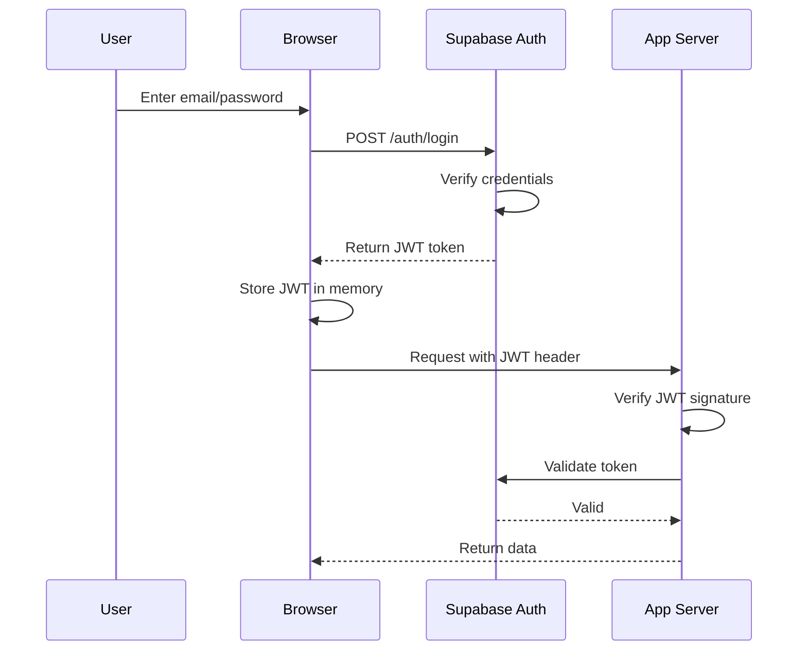

# Security & RBAC Guide - Sistem Manajemen Asprak

**Document Type**: Security Documentation  
**Last Updated**: March 16, 2026  
**Classification**: Internal  
**Status**: Active

---

## Table of Contents

1. [Overview](#overview)
2. [Authentication](#authentication)
3. [Authorization (RBAC)](#authorization-rbac)
4. [Server-side Security](#server-side-security)
5. [Database Security](#database-security)
6. [Data Protection](#data-protection)
7. [Audit & Compliance](#audit--compliance)
8. [Security Checklist](#security-checklist)

---

## Overview

The Sistem Manajemen Asprak implements security at multiple layers:

1. **Authentication Layer**: Verify who the user is
2. **Authorization Layer**: Verify what the user can do
3. **Database Layer**: Enforce permissions at data level
4. **Transport Layer**: Encrypt data in transit
5. **Audit Layer**: Log all significant actions

### Security Principles

- **Least Privilege**: Users get minimum necessary permissions
- **Defense in Depth**: Multiple layers of security
- **Fail Secure**: Errors default to denying access
- **Audit Trail**: All actions are logged

---

## Authentication

### Authentication Flow



### JWT Token Structure

JWT tokens contain:

```json
{
  "sub": "user-id-uuid",
  "email": "user@example.com",
  "role": "ADMIN",
  "exp": 1679000000
}
```

**Token Lifetime**: 24 hours (configurable)

### Credential Storage

**Server-side** (`.env.local`):

```env
NEXT_PUBLIC_SUPABASE_URL=...        # Public - safe
NEXT_PUBLIC_SUPABASE_ANON_KEY=...   # Public - limited scope
SUPABASE_SERVICE_ROLE_KEY=...       # SECRET - never expose
```

**Security Rules**:

- `NEXT_PUBLIC_*` variables: Safe to expose to frontend
- Service role key: Handle like database password (keep secret)
- Never commit `.env.local` to git (.gitignore)
- Never log sensitive credentials

### Login Process

```typescript
// /app/(auth)/login/page.tsx
async function handleLogin(email: string, password: string) {
  const { data, error } = await supabase.auth.signInWithPassword({
    email,
    password,
  });

  if (error) {
    // Generic error message to prevent user enumeration
    showError('Invalid email or password');
    return;
  }

  // Token automatically stored by Supabase client
  // Redirect to dashboard
  router.push('/');
}
```

### Logout Process

```typescript
async function handleLogout() {
  await supabase.auth.signOut();
  // Token removed automatically
  router.push('/login');
}
```

---

## Authorization (RBAC)

### Role-Based Access Control

System has **three roles** with different permission levels:

#### Role: ADMIN

**Permissions**:

- View all data
- Create/edit/delete users
- Create/edit/delete asprak, jadwal, pelanggaran
- Import/export data
- Finalize/unfinalize violations
- Access audit logs
- System maintenance and settings

**Access Matrix**:
| Feature | View | Create | Edit | Delete |
|---------|------|--------|------|--------|
| Asprak | Yes | Yes | Yes | Yes |
| Jadwal | Yes | Yes | Yes | Yes |
| Pelanggaran | Yes | Yes | Yes | Yes |
| Plotting | Yes | Yes | Yes | No |
| User Management | Yes | Yes | No | No |
| Audit Logs | Yes | No | No | No |

#### Role: ASLAB (Assistant Lab Staff)

**Permissions**:

- View asprak, jadwal, pelanggaran
- Create/edit asprak
- Create/edit jadwal
- Create/edit/delete pelanggaran
- Finalize violations
- Import/export operational data
- Restricted: Delete asprak or jadwal
- Restricted: Manage users
- Restricted: Access audit logs

**Access Matrix**:
| Feature | View | Create | Edit | Delete | Finalize |
|---------|------|--------|------|--------|----------|
| Asprak | Yes | Yes | Yes | No | N/A |
| Jadwal | Yes | Yes | Yes | No | N/A |
| Pelanggaran | Yes | Yes | Yes | Yes | Yes |

#### Role: ASPRAK_KOOR (Asprak Coordinator)

**Permissions**:

- View asprak assigned to their course
- View violations for their course
- Finalize violations (for their course)
- Restricted: Create/edit/delete any data
- Restricted: View violations for other courses
- Restricted: Manage users

**Access Matrix** (Limited to assigned courses only):
| Feature | View | Create | Edit | Delete | Finalize |
|---------|------|--------|------|--------|----------|
| Pelanggaran (own) | Yes | No | No | No | Yes |
| Panduan (guide) | Yes | No | No | No | N/A |

---

### Authorization Implementation

#### Frontend Check

```typescript
// src/lib/auth.ts
export async function requireRole(roles: string[], redirectUrl?: string) {
  const supabase = await createClient();
  const user = await getUser();

  if (!user || !roles.includes(user.pengguna.role)) {
    redirect(redirectUrl || '/login');
  }

  return user;
}
```

#### Usage in Components

```typescript
// src/app/(dashboard)/manajemen-akun/page.tsx
export default async function ManajemenAkunPage() {
  await requireRole(['ADMIN']); // Redirects if not ADMIN

  return (
    // Page content accessible only to ADMIN
  );
}
```

#### API Route Protection

```typescript
// src/app/api/admin/users/route.ts
export async function POST(req: Request) {
  try {
    // Check role before processing
    await requireRole(['ADMIN']);

    const body = await req.json();
    // ... process request
    return NextResponse.json({ ok: true });
  } catch (error) {
    return NextResponse.json({ ok: false, error: error.message }, { status: 401 });
  }
}
```

---

## Server-side Security

### HTTP Headers Security

```typescript
// middleware.ts
export function middleware(request: NextRequest) {
  const response = NextResponse.next();

  // Security headers
  response.headers.set('X-Content-Type-Options', 'nosniff');
  response.headers.set('X-Frame-Options', 'DENY');
  response.headers.set('X-XSS-Protection', '1; mode=block');
  response.headers.set('Strict-Transport-Security', 'max-age=31536000');
  response.headers.set('Referrer-Policy', 'strict-origin-when-cross-origin');

  return response;
}
```

### Input Validation

Always validate user input before processing:

```typescript
// Good - Validate input
async function upsertAsprak(data: any, supabase: any) {
  // Validate required fields
  if (!data.nim || !data.nama_lengkap) {
    throw new Error('Missing required fields');
  }

  // Validate NIM format (numeric, 8-10 digits)
  if (!/^\d{8,10}$/.test(data.nim)) {
    throw new Error('Invalid NIM format');
  }

  // Process data...
}
```

### CSRF Protection

Next.js provides built-in CSRF protection for forms and API routes.

### SQL Injection Prevention

Never build SQL queries with string concatenation. Use parameterized queries:

```typescript
// Incorrect - SQL Injection vulnerability
const query = `SELECT * FROM asprak WHERE nim = '${nim}'`;

// Correct - Parameterized query via Supabase
const { data } = await supabase.from('asprak').select('*').eq('nim', nim); // Parameter safely handled
```

### Environment Variables

```typescript
// Correct - Access via process.env or config
const apiUrl = process.env.NEXT_PUBLIC_SUPABASE_URL;

// Incorrect - Hardcoding secrets
const apiUrl = 'https://...'; // Never hardcode
const secretKey = 'sk_live_...'; // Never hardcode
```

---

## Database Security

### Row-Level Security (RLS) Policies

RLS enforces permissions at the database level:

```sql
-- Example RLS policy for ASPRAK_KOOR
CREATE POLICY "Coordinators see only their violations"
ON pelanggaran
FOR SELECT
USING (
  EXISTS (
    SELECT 1 FROM asprak_koordinator
    WHERE id_pengguna = auth.uid()
      AND is_active = true
      AND id_praktikum IN (
        SELECT id_praktikum FROM jadwal
        WHERE id = id_jadwal
      )
  )
);
```

**How it works**:

1. User makes query: `SELECT * FROM pelanggaran`
2. Database automatically adds RLS filter based on user context
3. Only rows matching policy are returned
4. Prevents accidental data exposure

### Data Integrity

Foreign key constraints prevent invalid relationships:

```sql
-- Prevent deletion of a course that has violations
ALTER TABLE pelanggaran
ADD CONSTRAINT fk_jadwal
FOREIGN KEY (id_jadwal)
REFERENCES jadwal(id)
ON DELETE RESTRICT;
```

### Immutable Records

Critical records cannot be modified after finalization:

```typescript
// Service layer - enforce immutability
if (violation.is_finalized && attempting_to_update) {
  throw new Error('Cannot update finalized violation');
}
```

---

## Data Protection

### Data at Rest (Encryption)

- Supabase encrypts database at rest: Enabled by default
- Sensitive data (credentials, secrets): Stored securely

### Data in Transit (HTTPS)

All communication between client and server must be encrypted:

- HTTPS enabled for all endpoints
- Redirect HTTP to HTTPS
- HSTS headers implemented

### Sensitive Data Handling

**Principle**: Never log or expose sensitive information

```typescript
// Incorrect - Logging sensitive data
logger.info('User created:', {
  email: user.email,
  password: user.password, // Do not log passwords
});

// Correct - Log minimal info
logger.info('User created:', {
  userId: user.id,
  email: user.email,
  // Password not included
});
```

### Password Policy

- Minimum 8 characters
- Managed by Supabase (automatic password hashing with bcrypt)
- Users cannot see others' passwords
- Password reset via email only

---

## Audit and Compliance

### Audit Logging

Every significant action is logged:

```sql
SELECT
  id,
  id_pengguna,
  action,
  table_name,
  record_id,
  new_values,
  created_at
FROM audit_logs
ORDER BY created_at DESC
LIMIT 100;
```

### What Gets Logged

| Action                | Logged | Example                                      |
| --------------------- | ------ | -------------------------------------------- |
| Create asprak         | Yes    | `INSERT INTO asprak ...`                     |
| Update jadwal         | Yes    | `UPDATE jadwal SET ...`                      |
| Delete pelanggaran    | Yes    | `DELETE FROM pelanggaran WHERE ...`          |
| Finalize violation    | Yes    | `UPDATE pelanggaran SET is_finalized = true` |
| User login            | Yes    | Authentication event                         |
| Authorization failure | Yes    | Access denied event                          |

### Auditable Information

For each audit log entry:

- **Who**: User ID and email
- **What**: Table, action, field changes
- **When**: Precise timestamp
- **Why**: Action type (INSERT, UPDATE, DELETE)

### Data Retention

- Active data: Kept indefinitely
- Audit logs: Kept for 3 years minimum
- Backup copies: Multiple backups (Supabase handles)

### Compliance Features

- RBAC for access control
- Audit trail for accountability
- Immutable violation records (prevents tampering)
- User activity logging
- Data encryption at rest and in transit
- Regular backups

---

## Security Checklist

### Development

- [ ] Environment variables use `.env.local` (never committed)
- [ ] Secrets never hardcoded in source code
- [ ] Input validation on all API endpoints
- [ ] Error messages don't expose system details
- [ ] Sensitive data never logged
- [ ] SQL queries use parameters (not string concatenation)
- [ ] HTTPS only for all endpoints

### Deployment

- [ ] `.env.local` secrets configured in production
- [ ] HTTPS certificates valid and updated
- [ ] Security headers configured
- [ ] Database backups enabled
- [ ] Audit logging enabled
- [ ] User roles correctly assigned
- [ ] Maintenance page secured (ADMIN only)

### Runtime

- [ ] Monitor for unauthorized access attempts
- [ ] Check audit logs regularly
- [ ] Update dependencies when security patches available
- [ ] Rotate credentials periodically
- [ ] Monitor RLS policies effectiveness
- [ ] Test disaster recovery procedures

### Data Protection

- [ ] No unencrypted sensitive data in logs
- [ ] Backup encryption enabled
- [ ] Database credentials secure
- [ ] JWT tokens validated on each request
- [ ] Session tokens expire appropriately
- [ ] Forgotten data purged after retention period

---

## Security Incident Response

### If you suspect a security breach:

1. **Stop**: Don't panic, isolate the system if possible
2. **Detect**: Identify what happened
   - Check audit logs
   - Review recent changes
   - Check for unauthorized access
3. **Notify**: Alert the security team immediately
4. **Investigate**: Gather evidence
5. **Remediate**: Fix the vulnerability
6. **Learn**: Review and prevent similar incidents

### Contact For Security Issues

**DO NOT** disclose security issues publicly.

- Report to: security@lab.id
- Use PGP encryption if available
- Allow time for remediation before disclosure

---

## Related Documents

- [Architecture Document](./ARCHITECTURE.md)
- [Database Schema](./DATABASE.md)
- [Deployment Guide](./DEPLOYMENT.md)
- [Troubleshooting Guide](./TROUBLESHOOTING.md)

---

**Last Updated**: March 16, 2026  
**Reviewed By**: Security Team  
**Next Review**: September 16, 2026  
**Classification**: Internal - Do Not Distribute
