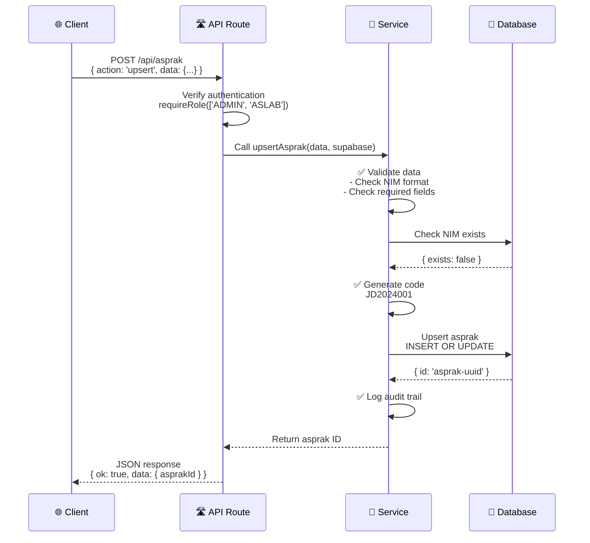

# Services Documentation - Sistem Manajemen Asprak

**Document Type**: Services Architecture  
**Last Updated**: March 16, 2026  
**Status**: Active

---

## Table of Contents

1. [Overview](#overview)
2. [Service Layer Pattern](#service-layer-pattern)
3. [Core Services](#core-services)
4. [Service Interactions](#service-interactions)
5. [Error Handling](#error-handling)
6. [Best Practices](#best-practices)

---

## Overview

The **Services Layer** encapsulates all business logic, data operations, and validations. It acts as the bridge between HTTP request handlers (API routes) and the database.

### Architecture

```
API Route (HTTP)
    ↓
    │ req.json()
    ↓
Service Function
    ├─ Validate input
    ├─ Check business rules
    ├─ Query database
    └─ Transform result
    ↓
    │ result
    ↓
API Route (HTTP Response)
```

**Location**: `/src/services/`

**Pattern**: Pure functions accepting `supabase` client + input data

---

## Service Layer Pattern

### Service Function Template

All services follow this pattern:

```typescript
import { SupabaseClient } from '@supabase/supabase-js';

/**
 * Create or update an asprak record
 * @param data - Asprak data { nim, nama_lengkap, angkatan, ... }
 * @param supabase - Supabase client with user context
 * @returns - Asprak ID (new or existing)
 * @throws - Error if validation fails or operation fails
 */
export async function upsertAsprak(data: any, supabase: SupabaseClient): Promise<string> {
  // 1. Validate input
  if (!data.nim || !data.nama_lengkap) {
    throw new Error('Missing required fields');
  }

  // 2. Check business rules
  const exists = await checkNimExists(data.nim, supabase);
  if (exists && isUpdate === false) {
    throw new Error('NIM sudah terdaftar');
  }

  // 3. Transform data
  const processedData = {
    ...data,
    kode_asprak: data.kode_asprak || generateCode(data.nama_lengkap),
  };

  // 4. Execute database operation
  const { data: result, error } = await supabase
    .from('asprak')
    .upsert(processedData, { onConflict: 'nim' })
    .select('id')
    .single();

  if (error) throw error;

  return result.id;
}
```

### Key Characteristics

1. **Pure Function**: Same input → Same output (deterministic)
2. **Async**: Returns Promise (for database operations)
3. **Typed**: TypeScript types for all parameters/returns
4. **Documented**: JSDoc comments for clarity
5. **Error Handling**: Throws specific errors with messages
6. **Single Responsibility**: One service = one domain

---

## Core Services

### 1. `asprakService.ts`

Manages teaching assistant (asprak) operations.

**Key Functions**:

```typescript
// Get all asprak (optionally filtered by term)
async function getAllAsprak(term?: string, supabase: any)
  → Promise<Asprak[]>

// Get single asprak with assignments
async function getAsprakAssignments(asprakId: string, supabase: any)
  → Promise<Assignment[]>

// Create or update asprak
async function upsertAsprak(data: any, supabase: any)
  → Promise<string> // Returns asprak ID

// Bulk import from CSV
async function bulkUpsertAspraks(rows: any[], supabase: any)
  → Promise<{ created: number; updated: number; failed: number }>

// Delete asprak
async function deleteAsprak(id: string, supabase: any)
  → Promise<void>

// Check NIM availability
async function checkNimExists(nim: string, supabase: any)
  → Promise<boolean>

// Generate unique asprak code
async function generateUniqueCode(name: string, supabase: any)
  → Promise<string>

// Update course assignments
async function updateAsprakAssignments(
  asprakId: string,
  term: string,
  praktikumIds: string[],
  supabase: any
) → Promise<void>
```

**Business Rules**:

- NIM must be unique
- Kode asprak auto-generated if not provided
- NIM format: numeric, 8-10 digits
- Cannot delete if has violations

---

### 2. `jadwalService.ts`

Manages schedule (jadwal) operations.

**Key Functions**:

```typescript
// Get all schedules or by term
async function getAllJadwal(supabase: any)
  → Promise<Jadwal[]>

async function getJadwalByTerm(term: string, supabase: any)
  → Promise<Jadwal[]>

// Get today's schedule
async function getTodaySchedule(limit: number, term?: string, supabase: any)
  → Promise<Jadwal[]>

// Create or update schedule
async function createJadwal(data: any, supabase: any)
  → Promise<Jadwal>

async function updateJadwal(data: any, supabase: any)
  → Promise<Jadwal>

// Delete schedule(s)
async function deleteJadwal(id: string, supabase: any)
  → Promise<void>

async function deleteJadwalByTerm(term: string, supabase: any)
  → Promise<void>

// Bulk import
async function bulkCreateJadwal(rows: any[], supabase: any)
  → Promise<Jadwal[]>
```

**Business Rules**:

- Valid days: Monday - Friday
- Start time must be before end time
- Room name required
- Modul number must be positive

---

### 3. `pelanggaranService.ts`

Manages violation (pelanggaran) tracking.

**Key Functions**:

```typescript
// Get violations with filtering
async function getPelanggaranByFilter(
  praktikumId?: string,
  tahunAjaran?: string,
  supabase: any
) → Promise<Pelanggaran[]>

// Get violation counts by praktikum
async function getPelanggaranCountsByPraktikum(isKoor: boolean, supabase: any)
  → Promise<{ praktikum_id: string; count: number }[]>

// Get summary with filtering
async function getPelanggaranSummary(
  tahunAjaran: string,
  modul?: number,
  minCount?: number,
  supabase: any
) → Promise<SummaryData[]>

// Create single violation
async function createPelanggaran(data: any, supabase: any)
  → Promise<Pelanggaran>

// Bulk create violations
async function bulkCreatePelanggaran(inputs: any[], supabase: any)
  → Promise<Pelanggaran[]>

// Delete violation
async function deletePelanggaran(id: string, supabase: any)
  → Promise<void>

// Finalize violations (make immutable)
async function finalizePelanggaranByPraktikum(praktikumId: string, userId: string)
  → Promise<void>

// Reset finalization (ADMIN only)
async function unfinalizePelanggaranByPraktikum(praktikumId: string)
  → Promise<void>
```

**Business Rules**:

- Valid types: Tidak Hadir, Terlambat, Tidak Lengkap, Lainnya
- Cannot delete finalized violations
- Only ADMIN can unfinalize
- Coordinator can only see their violations

---

### 4. `plottingService.ts`

Manages assignment plotting and validation.

**Key Functions**:

```typescript
// Validate plotting import
async function validatePlottingImport(
  rows: { kode_asprak: string; mk_singkat: string }[],
  term: string,
  supabase: any
) → Promise<ValidationResult>

// Save validated plotting
async function savePlotting(
  assignments: { asprak_id: string; praktikum_id: string }[],
  supabase: any
) → Promise<void>

// Get plotting data with assignments
async function getPlottingList(
  page: number,
  limit: number,
  term?: string
) → Promise<PlottingData[]>
```

**Business Rules**:

- Asprak code must exist
- Course (mk_singkat) must exist
- Practical (praktikum) must exist for term
- Cannot assign same asprak to same course twice

---

### 5. `mataKuliahService.ts`

Manages course (mata kuliah) information.

**Key Functions**:

```typescript
// Get all courses
async function getAllMataKuliah(supabase: any)
  → Promise<MataKuliah[]>

// Create or update course
async function upsertMataKuliah(data: any, supabase: any)
  → Promise<string>

// Delete course
async function deleteMataKuliah(id: string, supabase: any)
  → Promise<void>
```

---

### 6. `termService.ts`

Manages academic terms/years.

**Key Functions**:

```typescript
// Get available terms
async function getAvailableTerms(supabase: any)
  → Promise<string[]>
  // Returns: ["2024/1", "2024/2", "2025/1"]

// Get current term
async function getCurrentTerm(supabase: any)
  → Promise<string>
```

---

### 7. `auditLogService.ts`

Manages audit trail logging.

**Key Functions**:

```typescript
// Log change
async function logAuditTrail(
  userId: string,
  action: 'INSERT' | 'UPDATE' | 'DELETE',
  tableName: string,
  recordId: string,
  oldValues?: any,
  newValues?: any,
  supabase: any
) → Promise<void>

// Get audit logs
async function getAuditLogs(filters: any, supabase: any)
  → Promise<AuditLog[]>
```

**Logged Events**:

- ✅ Create asprak
- ✅ Update jadwal
- ✅ Delete pelanggaran
- ✅ Finalize violations
- ✅ User login

---

### 8. `systemService.ts`

Manages system-wide operations.

**Key Functions**:

```typescript
// Maintenance mode
async function getMaintenanceStatus(supabase: any)
  → Promise<boolean>

async function setMaintenanceStatus(active: boolean, userId: string, supabase: any)
  → Promise<void>

// System health
async function checkDatabaseHealth(supabase: any)
  → Promise<HealthStatus>
```

---

## 🔄 Service Interactions

### Typical Flow: Create Asprak



### Coordination Between Services

```
asprakService
  ├─ Uses: termService (get available terms)
  └─ Queries: asprak_praktikum (to check assignments)

plottingService
  ├─ Uses: asprakService (get asprak by code)
  └─ Queries: praktikum, mata_kuliah

pelanggaranService
  ├─ Uses: termService (get terme)
  └─ Queries: jadwal (to get course info)
```

---

## ⚠️ Error Handling

### Service Error Patterns

```typescript
// 1. Validation error (user's fault)
if (!data.nim) {
  throw new Error('NIM is required'); // 400 Bad Request
}

// 2. Conflict error (data conflict)
if (nimAlreadyExists) {
  throw new Error('NIM sudah terdaftar dalam sistem'); // 409 Conflict
}

// 3. Not found error
if (!asprak) {
  throw new Error('Asprak not found'); // 404 Not Found
}

// 4. Authorization error
if (user.role !== 'ADMIN') {
  throw new Error('Forbidden'); // 403 Forbidden
}

// 5. Database error (service's fault)
if (error) {
  throw new Error(`Database error: ${error.message}`); // 500 Server Error
}
```

### API Route Error Mapping

```typescript
export async function POST(req: Request) {
  try {
    const result = await service.operation(data, supabase);
    return NextResponse.json({ ok: true, data: result });
  } catch (error: any) {
    // Map service errors to HTTP status codes
    if (error.message.includes('sudah terdaftar')) {
      return NextResponse.json({ ok: false, error: error.message }, { status: 409 });
    }
    if (error.message.includes('not found')) {
      return NextResponse.json({ ok: false, error: error.message }, { status: 404 });
    }
    if (error.message.includes('Forbidden')) {
      return NextResponse.json({ ok: false, error: error.message }, { status: 403 });
    }
    // Default to server error
    return NextResponse.json({ ok: false, error: error.message }, { status: 500 });
  }
}
```

---

## 📋 Best Practices

### 1. Keep Services Focused

```typescript
// ✅ Good - Single responsibility
export async function createAsprak(data: any, supabase: SupabaseClient) {
  // Only asprak creation logic
}

// ❌ Bad - Too many responsibilities
export async function complexOperation(data: any, supabase: SupabaseClient) {
  // Create asprak
  // Create jadwal
  // Create assignments
  // Send emails
  // Log audit
  // ... too much!
}
```

### 2. Make Functions Testable

```typescript
// ✅ Good - Pure, testable function
export async function generateCode(name: string): Promise<string> {
  // No side effects, just transformation
}

// ❌ Bad - Mixed concerns
export async function createAndNotifyAsprak(data: any, supabase: any) {
  // Database operation
  // Email notification
  // Hard to test in isolation
}
```

### 3. Use Type Safety

```typescript
// ✅ Good - Types everywhere
export async function createAsprak(
  data: CreateAsprakInput,
  supabase: SupabaseClient
): Promise<Asprak> {
  // Implementation
}

// ❌ Bad - Lost type information
export async function createAsprak(data: any, supabase: any): any {
  // Implementation
}
```

### 4. Document Assumptions

```typescript
/**
 * Create violation record
 *
 * @param data - Violation data
 * @param supabase - Supabase client (with user context)
 *
 * @throws Error if:
 *   - Asprak doesn't exist
 *   - Jadwal doesn't exist
 *   - Violation already finalized
 *
 * @note Automatically logged in audit trail
 * @note RLS policies enforce coordinator access
 */
export async function createPelanggaran(data: any, supabase: SupabaseClient): Promise<Pelanggaran> {
  // Implementation
}
```

---

## 🔗 Related Documents

- [API Reference](./API_REFERENCE.md)
- [Architecture Document](./ARCHITECTURE.md)
- [Database Schema](./DATABASE.md)

---

**Last Updated**: March 16, 2026  
**Maintained By**: Development Team
